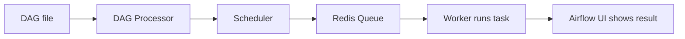

<!-- mCQ ANSWER  -->

1) d
2) b
3) a
4) c
5) b
6) a
7) c
8) c
9) b
10) b

<!--  B1 Answer  -->
    //Output 
    employee_name   manager_name
    Anita            No Manager
    Divya            Chetan
    Gaurav          Farhan

<!-- B5 Answer  -->
<!-- Airflow DAG execution flow -->
## Airflow DAG file to task result in the UI

- **DAG file (`dags/`)** — Holds the Python code that defines the DAG and its tasks.
- **DAG Processor** — Reads and parses DAG files, then stores serialized DAG definitions in the metadata database.
- **PostgreSQL (metadata database)** — Stores DAG definitions, task-instance states, and other Airflow metadata.
- **Scheduler** — Checks the parsed DAG, decides when tasks are ready, and submits runnable tasks to the executor.
- **CeleryExecutor** — Sends scheduled task work to the Celery message broker.
- **Redis (message broker)** — Queues task messages for the Celery workers.
- **Celery Worker** — Picks up queued tasks, executes their operator code, and reports task status; task logs are written to the configured logs.
- **API Server** — Serves the Airflow UI and API; workers also use its task execution API when needed.
- **Airflow Web UI** — Displays DAG/task status from Airflow metadata and lets you view task logs.
- **Triggerer (when needed)** — Runs deferrable tasks while they wait; it is not part of the normal path for a regular task.